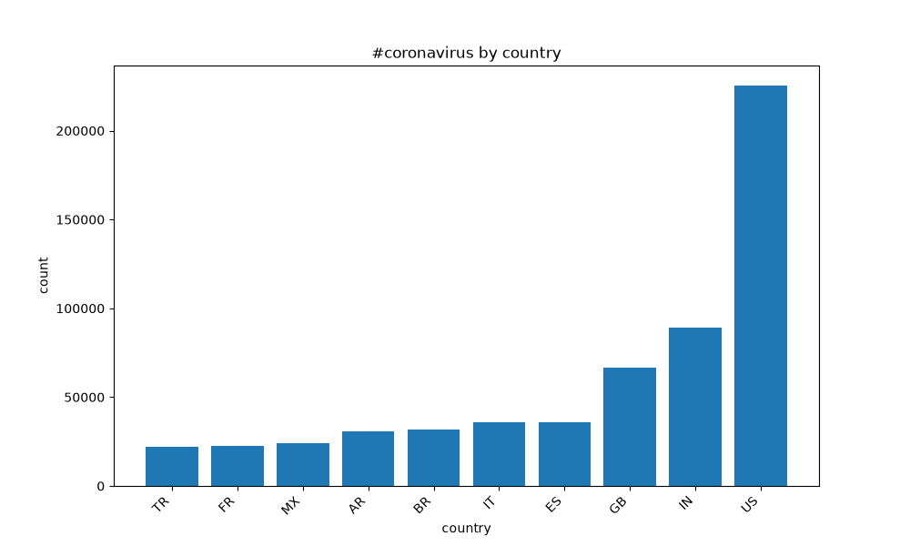
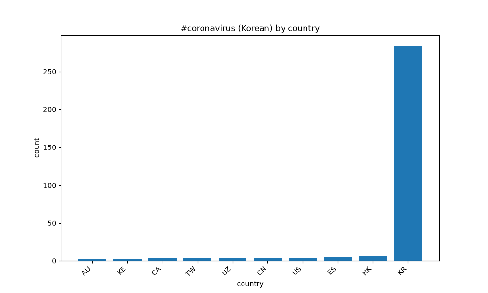
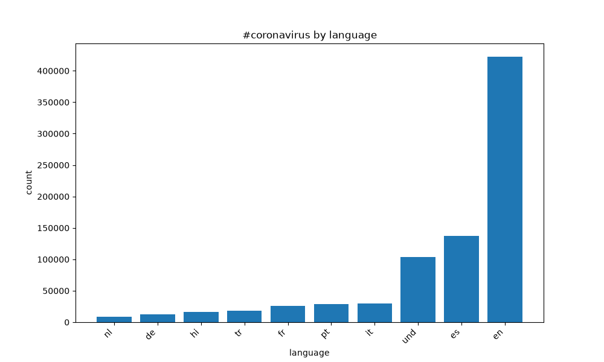
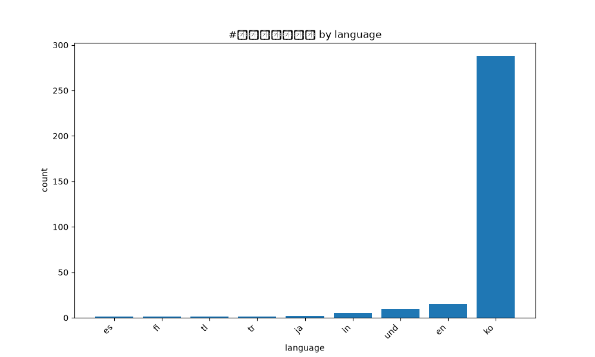
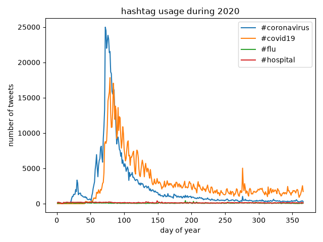

# Coronavirus Twitter Analysis

This project analyzes geotagged tweets posted during 2020 to examine how coronavirus-related hashtags were used across languages, countries, and time.

The dataset contains daily ZIP archives of tweets, with each tweet stored as JSON. The analysis uses a MapReduce-style workflow:

- `src/map.py` reads one daily archive and counts selected hashtags by tweet language and country.
- `run_maps.sh` runs the mapper on all 2020 archives in parallel and allows the jobs to continue after disconnecting from the server.
- `src/reduce.py` combines the daily mapper outputs into yearly totals for languages and countries.
- `src/visualize.py` selects the top 10 results, sorts them from lowest to highest, and creates bar charts.
- `src/alternative_reduce.py` combines daily language results and creates a line chart showing hashtag usage by day of the year.

## `#coronavirus` Tweets by Country

The top 10 country codes for tweets containing `#coronavirus`.

## `#코로나바이러스` Tweets by Country

The top 10 country codes for tweets containing the Korean hashtag `#코로나바이러스`.

## `#coronavirus` Tweets by Language

The top 10 tweet languages for tweets containing `#coronavirus`.

## `#코로나바이러스` Tweets by Language

The top 10 tweet languages for tweets containing the Korean hashtag `#코로나바이러스`.

## Daily Hashtag Usage During 2020

The daily number of tweets containing the hashtags supplied to `alternative_reduce.py`, plotted by day of the year.

